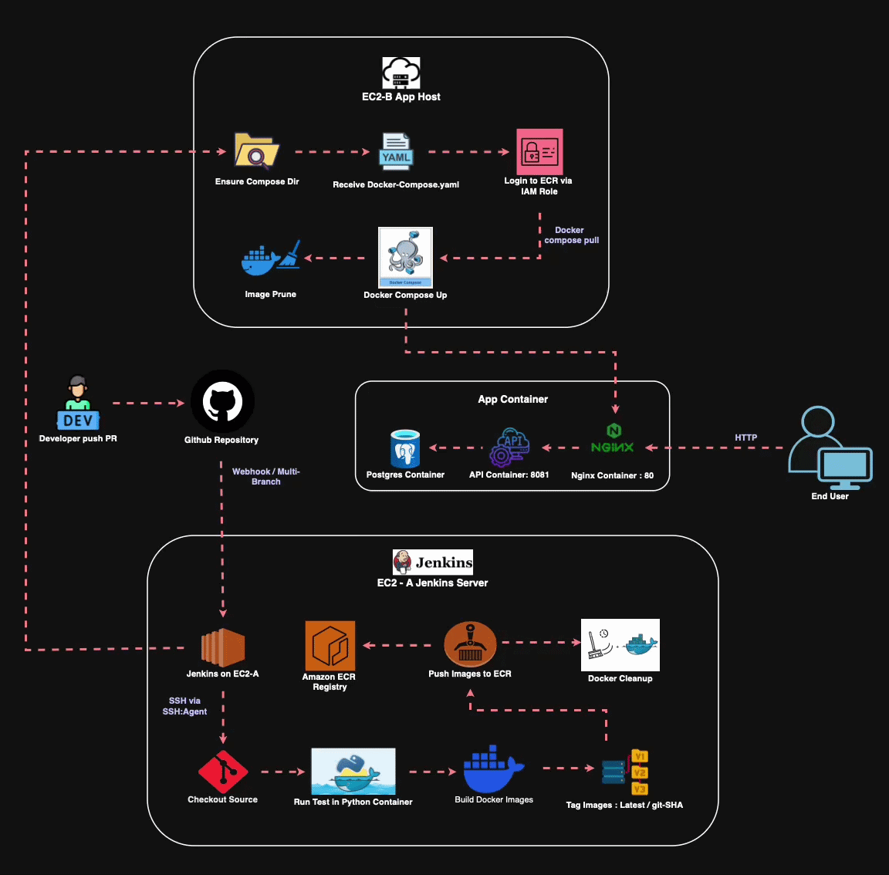
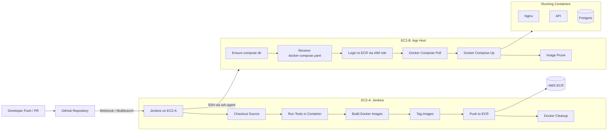

# DockDeploy — CI/CD Pipeline for Containerised Applications

**End‑to‑end CI/CD pipeline for a containerised full‑stack application.** Jenkins builds, tests, tags and pushes Docker images to AWS ECR, then securely deploys to an EC2 application host using SSH and Docker Compose.

---



## 🚀 Key Highlights

- Multibranch Jenkins pipeline (PRs run tests only; `main` runs full release)
- Containerised test execution using `python:3.12-slim` + pytest
- Immutable image tagging (`latest`, `build-<BUILD_NUMBER>`, `git-<COMMIT>`)
- Secure image push/pull using EC2 IAM roles (no AWS keys stored)
- Automated remote deployment via SSH Agent + Docker Compose
- Disk hygiene with Docker image/builder pruning
- Fail‑fast preflight validation

---

## 🏗️ High‑Level Architecture



---

## 📁 Repository Structure

```
.
├── api/                      # Flask API + tests
├── nginx/                    # Nginx config & Dockerfile
├── docker-compose.yaml       # Runtime compose (used on EC2‑B)
├── Jenkinsfile               # Multibranch pipeline
├── assets/                   # Place demo GIF here
└── README.md
```

---

## 🧪 Local Development & Testing

### Run API locally

```bash
git clone <repo-url>
cd <repo>
cd api
python -m venv .venv
source .venv/bin/activate
pip install -r requirements.txt
export FLASK_APP=app.py
flask run
```

### Run tests (same as CI)

```bash
docker run --rm -v "$PWD/api":/app -w /app \
  python:3.12-slim bash -lc \
  "pip install -r requirements.txt -r requirements-dev.txt && pytest -q"
```

---

## ⚙️ Jenkins Setup

### Required Plugins

- Pipeline
- Git
- SSH Agent Plugin
- Docker Pipeline (recommended)

### Required Jenkins Credentials

| Credential ID | Type | Purpose |
|---------------|------|--------|
| `SSH` | SSH Username with private key | Jenkins → EC2‑B access |
| `pg-db-name` | Secret text | POSTGRES_DB |
| `pg-db-user` | Secret text | POSTGRES_USER |
| `pg-db-password` | Secret text | POSTGRES_PASSWORD |
| `app-host-ip` | Secret text (optional) | EC2‑B private IP |

---

## 🔐 IAM Roles

### EC2‑A (Jenkins)

Attach role with permission:

- `AmazonEC2ContainerRegistryPowerUser`

Used for:

- Build & push images to ECR

---

### EC2‑B (App Host)

Attach role with permission:

- `AmazonEC2ContainerRegistryReadOnly`

Used for:

- Pull images from ECR during deploy

**Principle applied:** least privilege.

---

## 🚀 Deployment Flow (main branch)

1. Preflight validation
2. Checkout & resolve commit SHA
3. Run containerised tests
4. Login to ECR (instance role)
5. Build and tag images
6. Push images to ECR
7. Jenkins Docker cleanup
8. SSH to EC2‑B
9. Copy `docker-compose.yaml`
10. Remote ECR login
11. `docker compose pull`
12. `docker compose up -d`
13. Remote image cleanup

---

## 🧹 Disk Hygiene

To prevent CI host disk bloat:

On Jenkins:

```bash
docker image prune -f
docker builder prune -f
```

On EC2‑B:

```bash
docker image prune -f
```

---

## 🛡️ Security Best Practices Implemented

- No AWS keys stored in Jenkins
- IAM roles used for ECR auth
- SSH private key stored in Jenkins Credentials
- Least‑privilege role on app host
- Multibranch protection (deploy only on `main`)
- Build timeout protection

**Recommended future improvements:**

- Migrate secrets to AWS SSM Parameter Store
- Replace `StrictHostKeyChecking=no` with managed known_hosts
- Move database to RDS
- Add Terraform IaC
- Consider ECS/Fargate for production

---

## 🎬 Adding the Demo GIF

### Option A — Local Git (recommended)

```bash
mkdir -p assets
# copy your gif as:
# assets/deploy-demo.gif

# then uncomment the GIF line at the top of README

git add assets/deploy-demo.gif README.md
git commit -m "Add demo GIF"
git push
```

---

### Option B — GitHub Web UI

1. Open README.md in GitHub
2. Click Edit
3. Drag & drop your GIF
4. Move generated markdown to top
5. Commit

**Important:** ensure no secrets appear in the recording.

---

## 🧪 Troubleshooting

**Common issues:**

- `sshagent not found` → install SSH Agent plugin
- `error in libcrypto` → regenerate key with `ssh-keygen -m PEM`
- `Unable to locate credentials` → attach IAM role to EC2‑B
- Docker pull fails → verify ECR login on EC2‑B

---

## 📜 License

This project is for learning and portfolio purposes.

You may use the MIT License or your preferred license.

---

⭐ If this project helped you, consider giving it a star!

